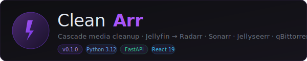
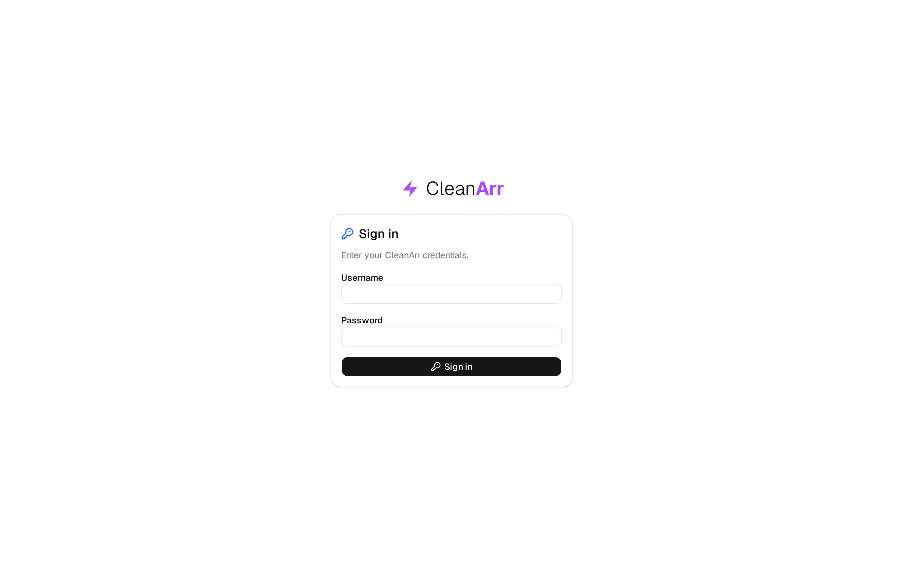
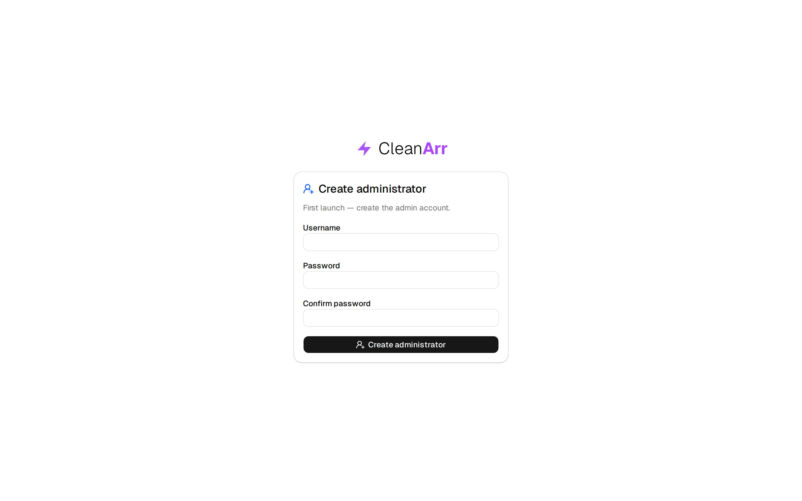
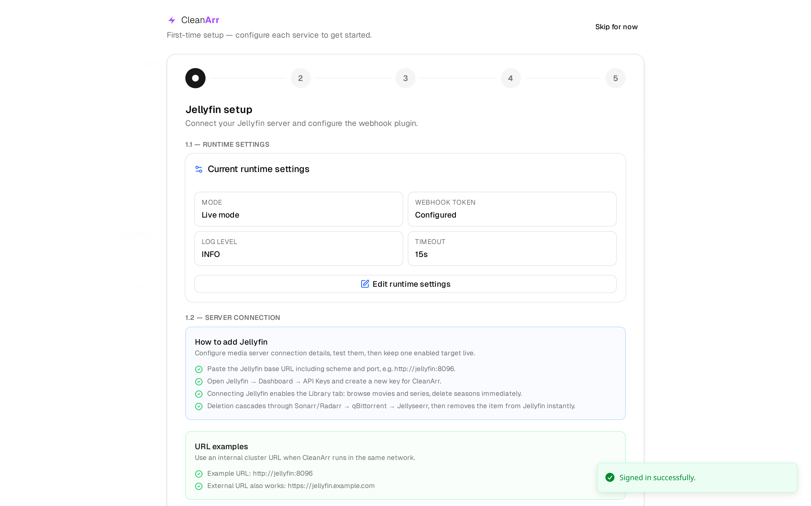
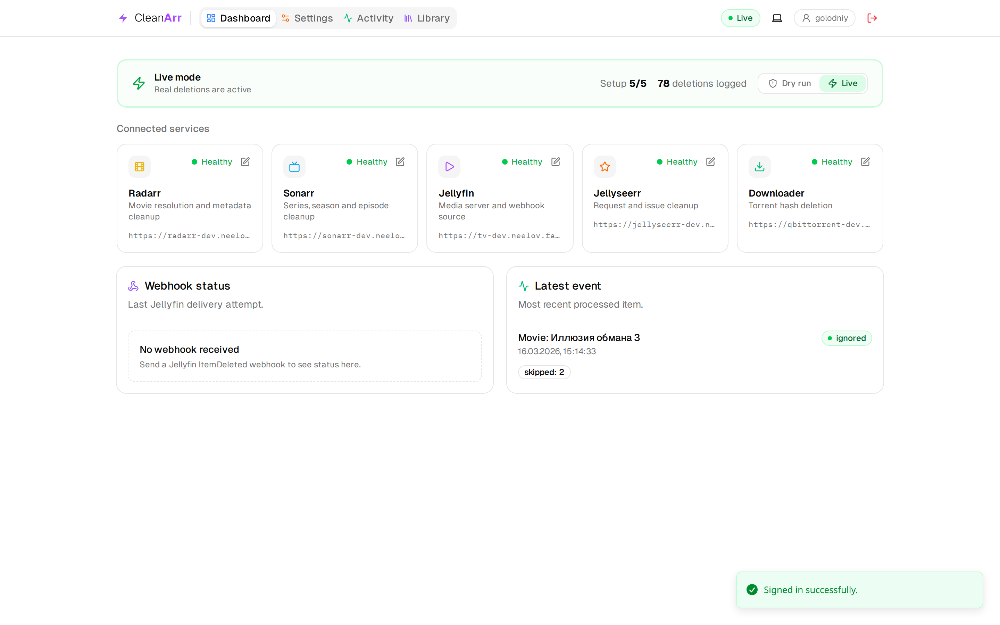
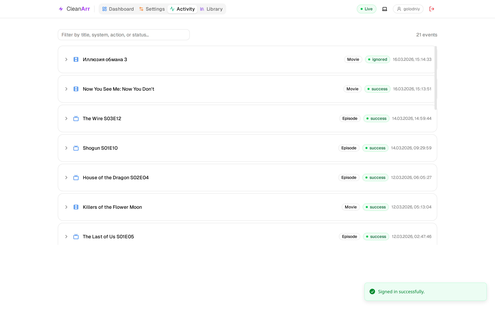
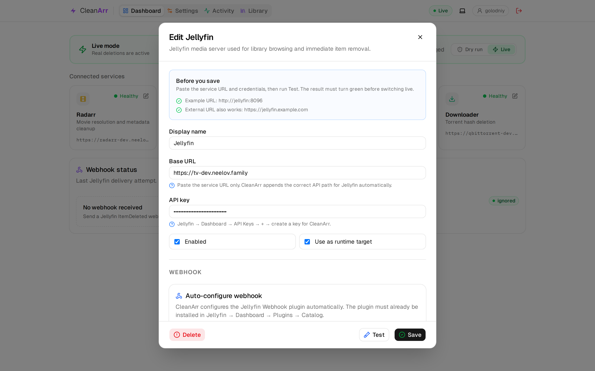
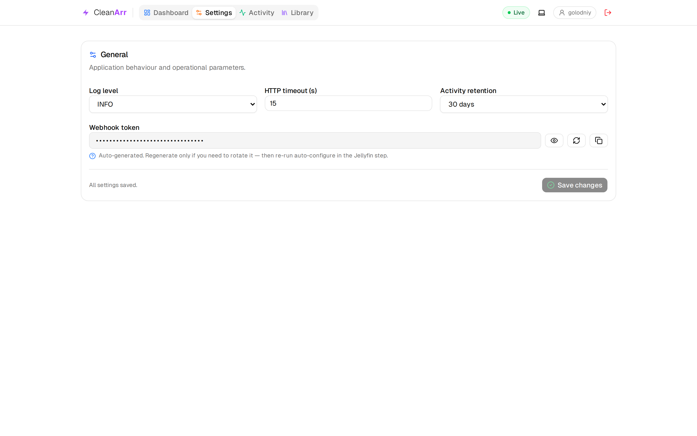

<p align="center">
  
</p>

<p align="center">
  <strong>Automatic cascade cleanup for your self-hosted media stack.</strong><br/>
  CleanArr listens for Jellyfin <code>ItemDeleted</code> webhooks and cascades deletion to Radarr, Sonarr, Jellyseerr, and qBittorrent — automatically, safely, and without touching files it doesn't own.
</p>

<p align="center">
  <a href="#quick-start"><strong>Quick start</strong></a> ·
  <a href="#screenshots"><strong>Screenshots</strong></a> ·
  <a href="#how-it-works"><strong>How it works</strong></a> ·
  <a href="#configuration"><strong>Configuration</strong></a> ·
  <a href="CONTRIBUTING.md"><strong>Contributing</strong></a>
</p>

<p align="center">
  
  
  
  
</p>

---

## What is CleanArr?

When you delete something in Jellyfin, you usually have to manually clean up the same item in Radarr, Sonarr, Jellyseerr, and qBittorrent. CleanArr automates this entire chain:

1. Jellyfin fires an `ItemDeleted` webhook
2. CleanArr resolves the item in Radarr/Sonarr using strict ID matching (TMDB → IMDB → path)
3. Torrent hashes are deleted from qBittorrent — only if they are exclusively owned by that item
4. The entry is removed from Radarr/Sonarr
5. Matching requests, issues, and media records are cleaned up in Jellyseerr

Pack torrents, shared files, and anything that can't be safely attributed are always skipped.

---

## Screenshots

<table>
  <tr>
    <td width="50%">
      
      <p align="center"><sub>Sign in screen</sub></p>
    </td>
    <td width="50%">
      
      <p align="center"><sub>First-run — create admin account</sub></p>
    </td>
  </tr>
  <tr>
    <td width="50%">
      
      <p align="center"><sub>Guided setup wizard — Jellyfin step</sub></p>
    </td>
    <td width="50%">
      
      <p align="center"><sub>Dashboard — all services healthy, Live mode</sub></p>
    </td>
  </tr>
  <tr>
    <td width="50%">
      
      <p align="center"><sub>Activity log with deletion history</sub></p>
    </td>
    <td width="50%">
      
      <p align="center"><sub>Jellyfin service editor — webhook auto-configure</sub></p>
    </td>
  </tr>
  <tr>
    <td colspan="2">
      
      <p align="center"><sub>Settings — General configuration</sub></p>
    </td>
  </tr>
</table>

---

## Features

- **Cascade deletion** — one webhook triggers a full cleanup chain: Jellyfin → Radarr/Sonarr → qBittorrent → Jellyseerr
- **Strict ID matching** — resolves items by TMDB/TVDB/IMDB ID and path; no fuzzy guessing
- **Conservative guardrails** — pack torrents and files shared between items are never deleted; CleanArr logs the reason and skips
- **Dry-run mode** — enabled by default; shows exactly what *would* happen without touching anything
- **Live health monitoring** — probes all connected services every 30 s; status visible on the dashboard
- **Webhook auto-configure** — one-click setup of the Jellyfin Webhook plugin directly from the UI
- **Activity log** — every processed event is stored with full action breakdown; searchable by title, system, action, or status
- **Guided setup wizard** — first-run wizard walks you through connecting each service step by step
- **Multi-profile** — save multiple service definitions per type, pick one as the active runtime target
- **Dark / light mode** — follows system preference

---

## Quick start

### Docker Compose

```bash
git clone https://github.com/mambastick/Cleanarr.git
cd Cleanarr

# Start (review environment variables in the compose file first)
docker compose -f deploy/docker-compose.yml up -d
```

Open **http://localhost:8089** — the setup wizard walks you through the rest.

### Docker (manual)

```bash
docker build -f deploy/Dockerfile -t cleanarr:latest .

docker run -d \
  --name cleanarr \
  -p 8089:8089 \
  -e DRY_RUN=true \
  -v cleanarr-config:/config \
  cleanarr:latest
```

### Kubernetes

```bash
kubectl apply -f deploy/k8s/namespace.yaml
kubectl apply -f deploy/k8s/pvc.yaml
# Edit secret.example.yaml with your values first
kubectl apply -f deploy/k8s/secret.example.yaml
kubectl apply -f deploy/k8s/deployment.yaml
kubectl apply -f deploy/k8s/service.yaml
kubectl apply -f deploy/k8s/ingress.yaml
```

The deployment uses `strategy: Recreate` because the config PVC is `ReadWriteOnce`.

---

## Configuration

All settings can be changed at runtime from the **Settings** tab. Environment variables provide defaults on first start.

| Variable | Default | Description |
|---|---|---|
| `DRY_RUN` | `true` | Set to `false` to enable real deletions |
| `LOG_LEVEL` | `INFO` | `DEBUG`, `INFO`, `WARNING`, `ERROR` |
| `HTTP_TIMEOUT_SECONDS` | `15` | Timeout for calls to downstream services |
| `DB_PATH` | `/config/cleanarr.db` | SQLite database path — must be on a persistent volume |
| `ADMIN_SHARED_TOKEN` | — | Optional static token that bypasses session auth (useful for automation) |
| `WEBHOOK_SHARED_TOKEN` | auto-generated | Shared secret verified on every inbound webhook. Auto-generated on first start; rotate from Settings → General |

> **Important:** `DB_PATH` must point to a persistent volume. Without it, all service configurations and activity history are lost on restart.

---

## Jellyfin webhook setup

The easiest way is to use **Auto-configure** in the Jellyfin service editor (click the pencil icon on the Jellyfin card in the Dashboard). It installs the correct config into the Jellyfin Webhook plugin automatically.

**Manual setup:** install the Webhook plugin in Jellyfin → Dashboard → Plugins → Catalog, then add a Generic destination:

- **URL:** `http://your-cleanarr-host:8089/webhook/jellyfin`
- **Method:** `POST`
- **Header:** `X-Webhook-Token: <your-token>`
- **Notification type:** `Item Deleted` only
- **Template:**

```handlebars
{
  "notification_type": "{{json_encode NotificationType}}",
  "item_type": "{{json_encode ItemType}}",
  "item_id": "{{json_encode ItemId}}",
  "name": "{{json_encode Name}}",
  "path": null,
  "tmdb_id": {{#if_exist Provider_tmdb}}{{Provider_tmdb}}{{else}}null{{/if_exist}},
  "tvdb_id": {{#if_exist Provider_tvdb}}{{Provider_tvdb}}{{else}}null{{/if_exist}},
  "imdb_id": {{#if_exist Provider_imdb}}"{{json_encode Provider_imdb}}"{{else}}null{{/if_exist}},
  "series_name": {{#if_exist SeriesName}}"{{json_encode SeriesName}}"{{else}}null{{/if_exist}},
  "series_id": {{#if_exist SeriesId}}"{{json_encode SeriesId}}"{{else}}null{{/if_exist}},
  "season_number": {{#if_exist SeasonNumber}}{{SeasonNumber}}{{else}}null{{/if_exist}},
  "episode_number": {{#if_exist EpisodeNumber}}{{EpisodeNumber}}{{else}}null{{/if_exist}},
  "episode_end_number": {{#if_exist EpisodeNumberEnd}}{{EpisodeNumberEnd}}{{else}}null{{/if_exist}},
  "occurred_at": "{{json_encode UtcTimestamp}}"
}
```

---

## How it works

### Movie deletion

1. Resolve in Radarr by `tmdb_id → imdb_id → path` (strict, no fuzzy matching)
2. Collect torrent hashes from Radarr download history
3. Delete safe hashes in qBittorrent (`deleteFiles=true`)
4. Delete the Radarr entry
5. Delete matching Jellyseerr requests, issues, and media records

### Series deletion

1. Resolve in Sonarr by `tvdb_id → tmdb_id → imdb_id → path`
2. Delete torrent hashes exclusively owned by the series
3. Delete the Sonarr series entry
4. Delete all Jellyseerr requests, issues, and media for the series

### Season deletion

1. Resolve parent series in Sonarr
2. Unmonitor all episodes in the target season
3. Delete only episode files and hashes fully covered by the season scope
4. Update or remove matching Jellyseerr season requests

### Episode deletion

1. Resolve parent series in Sonarr
2. Unmonitor the target episode range
3. Delete episode file and hash only when fully isolated
4. Jellyseerr partial-request cleanup skipped in v1

**Guardrails:** pack torrents (multiple series/seasons in one archive) and shared files are never deleted — CleanArr logs the reason and skips destructive actions.

---

## API reference

| Method | Path | Auth | Description |
|---|---|---|---|
| `POST` | `/webhook/jellyfin` | `X-Webhook-Token` header | Main ingestion endpoint |
| `GET` | `/api/dashboard` | session | Dashboard snapshot for the SPA |
| `GET` | `/api/config` | session | Runtime configuration |
| `POST` | `/api/config/general` | session | Update general settings |
| `POST` | `/api/config/jellyfin/setup-webhook` | session | Auto-configure the Jellyfin Webhook plugin |
| `POST` | `/api/auth/login` | — | Admin login |
| `GET` | `/health/live` | none | Liveness probe |
| `GET` | `/health/ready` | none | Readiness probe |

---

## Repository layout

```
cleanarr/
├── backend/                    # Python 3.12 / FastAPI
│   └── src/cleanarr/
│       ├── api/                # Routes, schemas, dashboard, auth
│       ├── application/        # Cascade deletion logic, configuration service
│       ├── domain/             # Models, config, errors
│       └── infrastructure/     # HTTP clients, SQLite stores, settings
├── frontend/                   # React 19 + Vite + TypeScript + shadcn/ui
│   └── src/
├── deploy/
│   ├── Dockerfile              # Multi-stage build (node:24 → python:3.12-slim)
│   ├── docker-compose.yml
│   └── k8s/                    # Kubernetes manifests
└── docs/
    └── screenshots/
```

---

## Stack

| Layer | Technology |
|---|---|
| Backend | Python 3.12, FastAPI, httpx, Pydantic v2, uvicorn |
| Frontend | React 19, Vite, TypeScript, shadcn/ui, Tailwind CSS v4, Sonner, Motion |
| Storage | SQLite (config + activity log) |
| Container | Multi-stage Docker build — node:24-bookworm-slim → python:3.12-slim |

---

## Development

```bash
# Backend
cd backend
python -m venv .venv && source .venv/bin/activate
pip install -e ".[dev]"

# Frontend (build static assets served by the backend)
cd frontend
pnpm install && pnpm build

# Run backend with hot reload
cd backend
uvicorn cleanarr.api.app:app --host 0.0.0.0 --port 8089 --reload
```

For full hot-reload on both sides, run the frontend dev server in parallel — it proxies `/api`, `/health`, and `/webhook` to port 8089:

```bash
# Terminal 2
cd frontend
pnpm dev
```

### Tests

```bash
cd backend && pytest
cd frontend && pnpm build   # also runs tsc
```

---

## License

[MIT](LICENSE)
