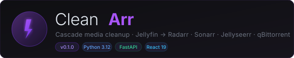
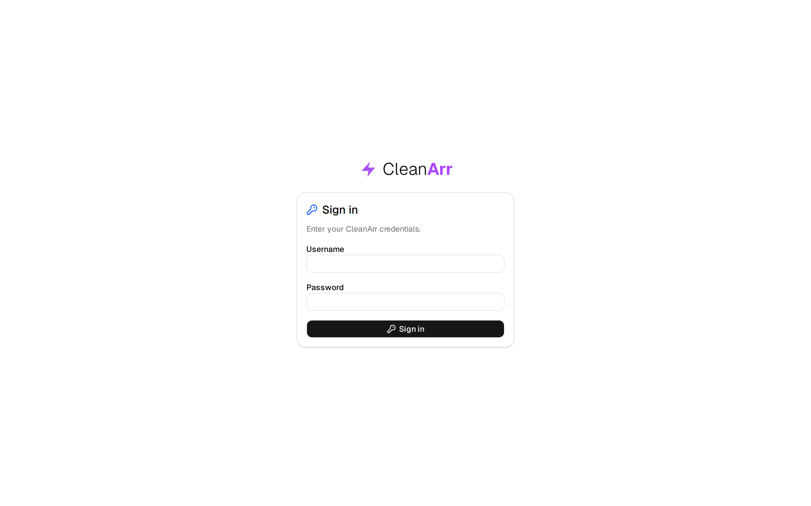
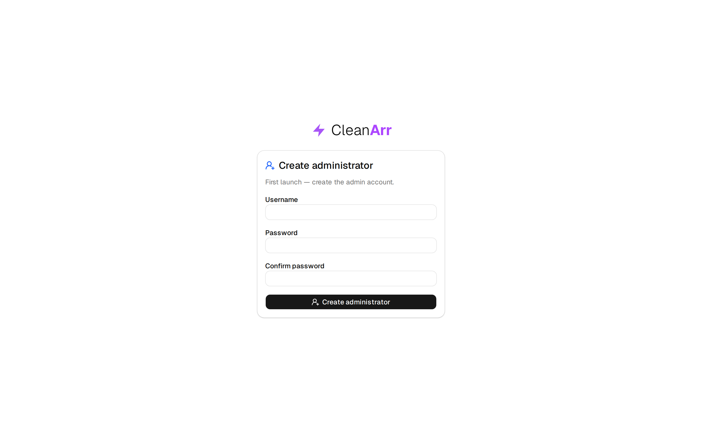
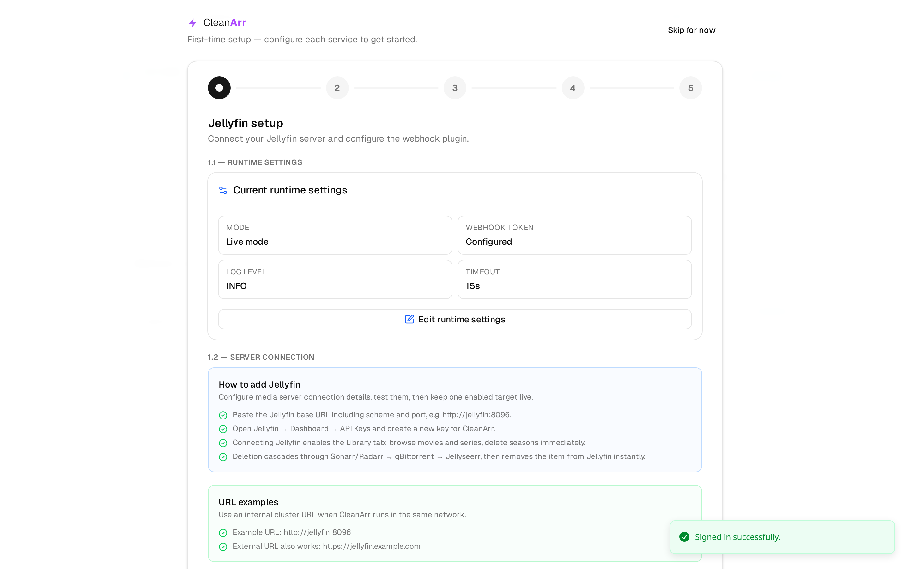
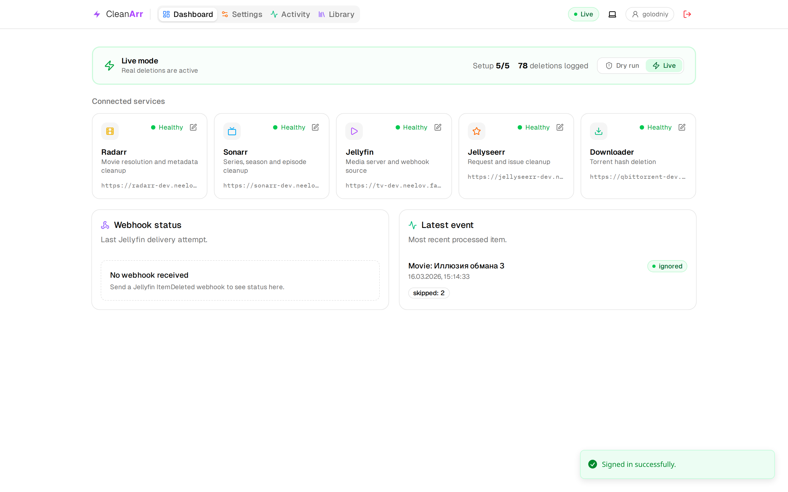
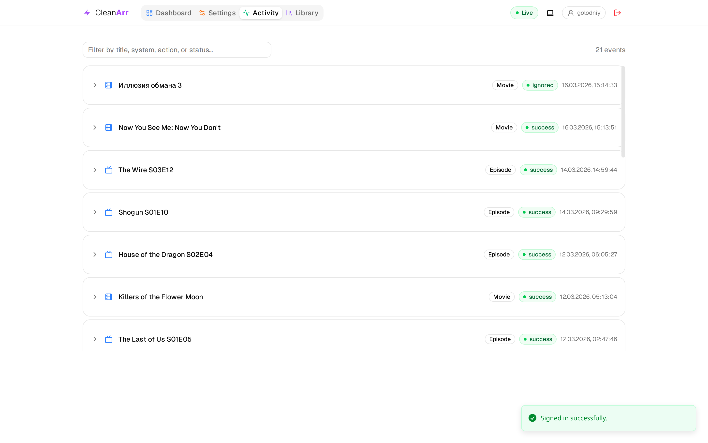
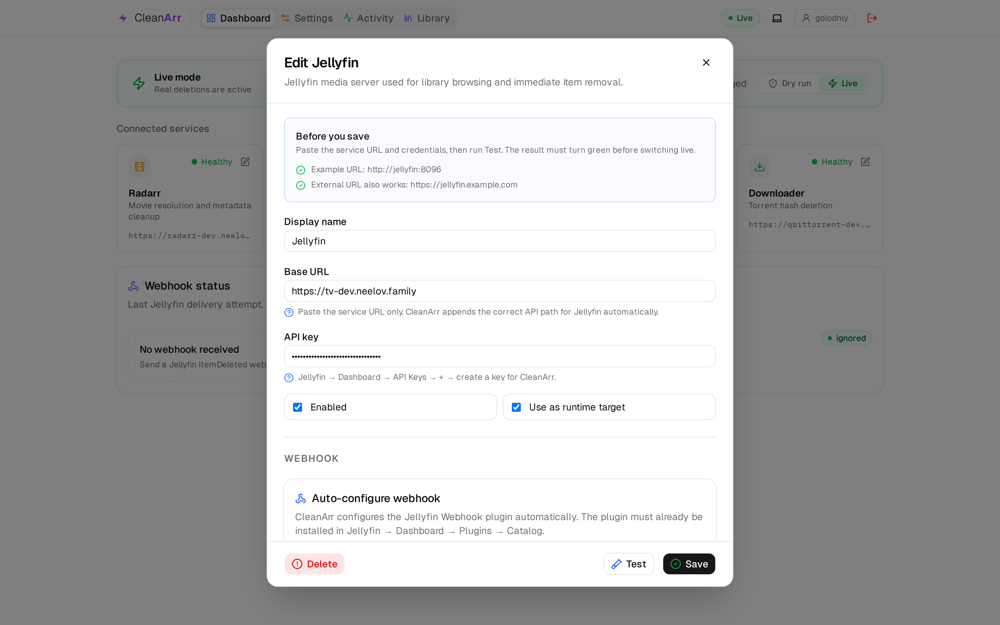
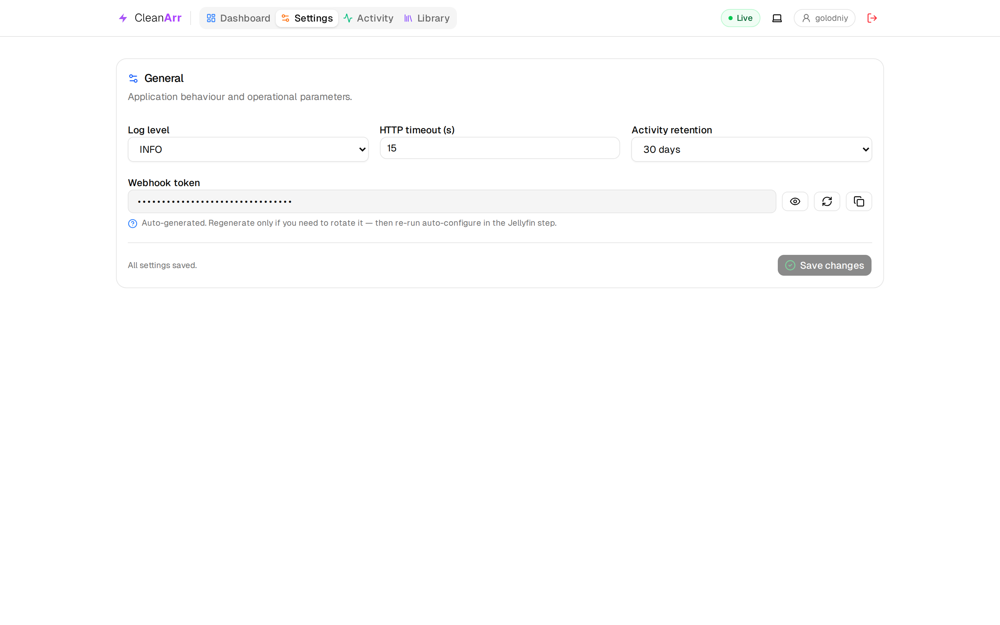

<p align="center">
  
</p>

<p align="center">
  <a href="README.md">English</a> · <strong>Русский</strong>
</p>

<p align="center">
  <strong>Автоматическая каскадная очистка домашней медиасистемы.</strong><br/>
  CleanArr принимает события Jellyfin <code>ItemDeleted</code> и безопасно удаляет связанные записи в Radarr, Sonarr, Seerr и поддерживаемых torrent-клиентах, не затрагивая файлы, принадлежность которых нельзя однозначно определить.
</p>

<p align="center">
  <a href="#быстрый-запуск"><strong>Быстрый запуск</strong></a> ·
  <a href="#нативные-пакеты-linux"><strong>Пакеты Linux</strong></a> ·
  <a href="#скриншоты"><strong>Скриншоты</strong></a> ·
  <a href="#как-это-работает"><strong>Как это работает</strong></a> ·
  <a href="#настройка"><strong>Настройка</strong></a> ·
  <a href="docs/TORRENT_CLIENTS_RU.md"><strong>Torrent-клиенты</strong></a> ·
  <a href="docs/ROADMAP_RU.md"><strong>Roadmap</strong></a> ·
  <a href="CONTRIBUTING_RU.md"><strong>Участие в разработке</strong></a>
</p>

<p align="center">
  
  
  
  
  
</p>

---

## Что такое CleanArr?

После удаления фильма или сериала в Jellyfin обычно приходится вручную удалять ту же сущность из Radarr, Sonarr, Seerr и torrent-клиентов. CleanArr автоматизирует всю цепочку:

1. Jellyfin отправляет webhook `ItemDeleted`.
2. CleanArr строго сопоставляет объект в Radarr или Sonarr по идентификаторам TMDB, TVDB, IMDB и пути.
3. Торренты направляются в qBittorrent, Transmission, Deluge и rTorrent только тогда, когда история Arr подтверждает владельца.
4. Запись удаляется из Radarr или Sonarr.
5. Связанные запросы, проблемы и медиазаписи очищаются в Seerr.

Раздачи-паки, общие файлы и любые неоднозначно определённые данные всегда пропускаются.

---

## Скриншоты

<table>
  <tr>
    <td width="50%">
      
      <p align="center"><sub>Форма входа</sub></p>
    </td>
    <td width="50%">
      
      <p align="center"><sub>Первый запуск — создание администратора</sub></p>
    </td>
  </tr>
  <tr>
    <td width="50%">
      
      <p align="center"><sub>Мастер первичной настройки Jellyfin</sub></p>
    </td>
    <td width="50%">
      
      <p align="center"><sub>Панель управления — сервисы доступны, рабочий режим</sub></p>
    </td>
  </tr>
  <tr>
    <td width="50%">
      
      <p align="center"><sub>Журнал истории удалений</sub></p>
    </td>
    <td width="50%">
      
      <p align="center"><sub>Редактор Jellyfin и автоматическая настройка webhook</sub></p>
    </td>
  </tr>
  <tr>
    <td colspan="2">
      
      <p align="center"><sub>Общие настройки CleanArr</sub></p>
    </td>
  </tr>
</table>

---

## Возможности

- **Каскадное удаление** — одно событие запускает очистку Jellyfin → Radarr/Sonarr → torrent-клиенты → Seerr.
- **Multi-instance маршрутизация** — все включённые профили Radarr, Sonarr и torrent-клиентов работают одновременно без коллизий числовых ID.
- **Строгое сопоставление** — TMDB, TVDB, IMDB и путь без приблизительного поиска.
- **Защитные ограничения** — общие файлы и торренты-паки не удаляются; причина пропуска записывается в журнал.
- **Подтверждаемый preflight** — перед каждым ручным удалением показывает точные media ID, Arr instance, torrent client/hash/path, будущие изменения и защитные пропуски.
- **Персистентная фоновая очистка** — ручные задания, частичные результаты и retry-состояние переживают рестарт процесса и показывают прогресс по шагам.
- **Идемпотентное выполнение** — завершённые события Jellyfin подавляются семь дней, частичные ошибки остаются retryable, а единый safety lock сериализует все деструктивные операции экземпляра CleanArr.
- **Мониторинг сервисов** — подключённые сервисы проверяются каждые 30 секунд.
- **Автонастройка webhook** — конфигурация Jellyfin Webhook из интерфейса CleanArr.
- **Журнал действий** — поиск по названию, системе, действию и результату.
- **Мастер первого запуска** — последовательное подключение сервисов.
- **Несколько профилей** — несколько конфигураций каждого типа сервиса с выбором активной.
- **Локальный вход и SSO** — пароль и строгая проверка OpenID Connect с PKCE, nonce и явной политикой users/groups/claims.
- **Светлая и тёмная темы** — автоматический выбор по настройкам системы.

---

## Быстрый запуск

### Docker Compose

```bash
git clone https://github.com/mambastick/Cleanarr.git
cd Cleanarr

# Перед запуском проверьте переменные окружения в compose-файле
docker compose -f deploy/docker-compose.yml up -d
```

Откройте **http://localhost:8089** — мастер настройки проведёт по оставшимся шагам.

Перед обновлением образа создайте и выгрузите проверенную резервную копию SQLite:

```bash
docker compose -f deploy/docker-compose.yml exec -T cleanarr python3 -c 'import sqlite3; source=sqlite3.connect("/config/cleanarr.db"); backup=sqlite3.connect("/config/cleanarr.pre-upgrade.db"); source.backup(backup); print(backup.execute("PRAGMA integrity_check").fetchone()[0]); backup.close(); source.close()'
docker compose -f deploy/docker-compose.yml cp \
  cleanarr:/config/cleanarr.pre-upgrade.db ./cleanarr.pre-upgrade.db
```

Проверка должна вывести `ok`. Для отката закрепите предыдущий тег образа,
остановите сервис, скопируйте проверенную копию обратно в
`/config/cleanarr.db` и снова запустите сервис. До проверки восстановления
сохраните неудачно обновлённую БД под другим именем.

### Docker вручную

```bash
docker run -d \
  --name cleanarr \
  -p 8089:8089 \
  -e DRY_RUN=true \
  -v cleanarr-config:/config \
  ghcr.io/mambastick/cleanarr:latest
```

### Нативные пакеты Linux

Для каждого релиза публикуются `.deb` и `.rpm` для `amd64` и `arm64`. Пакет устанавливает приложение в `/opt/cleanarr`, создаёт отдельного системного пользователя и добавляет защищённый systemd-сервис.

```bash
# Debian / Ubuntu
sudo apt install ./cleanarr_<версия>_amd64.deb

# Fedora / RHEL-совместимые системы
sudo dnf install ./cleanarr-<версия>-1.x86_64.rpm

sudo systemctl enable --now cleanarr
```

Основная конфигурация находится в `/etc/cleanarr/cleanarr.env`, данные — в `/var/lib/cleanarr`. Требуются systemd и Python 3.12. Обновление, удаление, резервное копирование и проверка контрольных сумм описаны в [руководстве по нативным пакетам](docs/LINUX_PACKAGES_RU.md).

### Kubernetes

```bash
kubectl apply -f deploy/k8s/namespace.yaml
kubectl apply -f deploy/k8s/pvc.yaml
# Сначала заполните secret.example.yaml
kubectl apply -f deploy/k8s/secret.example.yaml
kubectl apply -f deploy/k8s/deployment.yaml
kubectl apply -f deploy/k8s/service.yaml
kubectl apply -f deploy/k8s/ingress.yaml
```

Используется стратегия `Recreate`, потому что PVC с конфигурацией имеет режим `ReadWriteOnce`.

---

## Настройка

Все параметры можно изменить во вкладке **Настройки** во время работы. Переменные окружения задают значения по умолчанию для первого запуска.

| Переменная | По умолчанию | Назначение |
|---|---|---|
| `DRY_RUN` | `true` | `false` включает фактическое удаление |
| `LOG_LEVEL` | `INFO` | `DEBUG`, `INFO`, `WARNING` или `ERROR` |
| `HTTP_TIMEOUT_SECONDS` | `15` | Таймаут запросов к подключённым сервисам |
| `DB_PATH` | `/config/cleanarr.db` | Путь к SQLite на постоянном хранилище |
| `CONFIG_STATE_PATH` | `/config/runtime-config.json` | Путь миграции старой runtime-конфигурации |
| `ADMIN_SHARED_TOKEN` | — | Необязательный привилегированный токен для автоматизации |
| `WEBHOOK_SHARED_TOKEN` | создаётся автоматически | Секрет входящих webhook; меняется в Настройки → Общие |
| `UI_LANGUAGE` | `en` | Начальный язык интерфейса: `en` или `ru` |
| `JELLYFIN_LANGUAGE` | `en` | Язык метаданных интеграции Jellyfin |
| `SSO_MODE` | `password_only` | `password_only`, `both` или `sso_only` |
| `SSO_ENABLED` | `false` | Включение OpenID Connect |
| `SSO_ISSUER_URL` | — | URL издателя OpenID Connect |
| `SSO_CLIENT_ID` | — | Идентификатор клиента OpenID Connect |
| `SSO_CLIENT_SECRET` | — | Секрет клиента OpenID Connect |
| `SSO_REDIRECT_URI` | — | Callback, обычно `https://cleanarr.example/api/auth/sso/callback` |
| `SSO_SCOPES` | `openid profile email` | Запрашиваемые области OpenID Connect |
| `SSO_ALLOWED_USERS` | — | Разрешённые usernames/email/subject через запятую |
| `SSO_ALLOWED_GROUPS` | — | Разрешённые значения группы через запятую |
| `SSO_GROUP_CLAIM` | `groups` | Claim ID token со значениями групп |
| `SSO_REQUIRED_CLAIM` | — | Необязательный дополнительный claim для доступа |
| `SSO_REQUIRED_VALUE` | — | Обязательное значение; задаётся вместе с `SSO_REQUIRED_CLAIM` |
| `SESSION_COOKIE_SECURE` | auto | Принудительный флаг `Secure`; задайте `true`, если TLS завершается на proxy без доверия к forwarded headers |

> **Важно:** `DB_PATH` должен находиться на постоянном хранилище. Иначе после перезапуска будут потеряны настройки сервисов и журнал действий.

Существующие профили `jellyseerr` при запуске автоматически и без потери
данных преобразуются в каноническую конфигурацию `seerr`. Переменные
`JELLYSEERR_URL` / `JELLYSEERR_API_KEY` и маршруты `/api/config/jellyseerr`
остаются совместимыми псевдонимами.

SSO не включается, пока не задан хотя бы один разрешённый пользователь/группа
либо пара обязательного claim/value. Перед включением `both` или `sso_only`
прочитайте полное [руководство по OIDC и reverse proxy](docs/SSO_RU.md).

---

## Настройка webhook Jellyfin

Проще всего использовать кнопку **Автонастройка** в редакторе Jellyfin на панели управления. CleanArr самостоятельно создаст правильную конфигурацию плагина Webhook.

Для ручной настройки установите Webhook через Jellyfin → Панель управления → Плагины → Каталог и добавьте назначение Generic:

- **URL:** `http://your-cleanarr-host:8089/webhook/jellyfin`
- **Метод:** `POST`
- **Заголовок:** `X-Webhook-Token: <ваш-токен>`
- **Тип события:** только `Item Deleted`
- **Шаблон:**

```handlebars
{
  "notification_type": "{{json_encode NotificationType}}",
  "item_type": "{{json_encode ItemType}}",
  "item_id": "{{json_encode ItemId}}",
  "name": "{{json_encode Name}}",
  "path": null,
  "tmdb_id": {{#if_exist Provider_tmdb}}{{Provider_tmdb}}{{else}}null{{/if_exist}},
  "tvdb_id": {{#if_exist Provider_tvdb}}{{Provider_tvdb}}{{else}}null{{/if_exist}},
  "imdb_id": {{#if_exist Provider_imdb}}"{{json_encode Provider_imdb}}"{{else}}null{{/if_exist}},
  "series_name": {{#if_exist SeriesName}}"{{json_encode SeriesName}}"{{else}}null{{/if_exist}},
  "series_id": {{#if_exist SeriesId}}"{{json_encode SeriesId}}"{{else}}null{{/if_exist}},
  "season_number": {{#if_exist SeasonNumber}}{{SeasonNumber}}{{else}}null{{/if_exist}},
  "episode_number": {{#if_exist EpisodeNumber}}{{EpisodeNumber}}{{else}}null{{/if_exist}},
  "episode_end_number": {{#if_exist EpisodeNumberEnd}}{{EpisodeNumberEnd}}{{else}}null{{/if_exist}},
  "occurred_at": "{{json_encode UtcTimestamp}}"
}
```

---

## Как это работает

### Удаление фильма

1. Поиск в Radarr по `tmdb_id → imdb_id → path`.
2. Получение torrent hash из истории загрузок Radarr.
3. Удаление безопасно определённых раздач во всех владеющих ими torrent-клиентах, при необходимости вместе с локальными данными.
4. Удаление записи Radarr.
5. Удаление связанных запросов, проблем и записей Seerr.

### Удаление сериала

1. Поиск в Sonarr по `tvdb_id → tmdb_id → imdb_id → path`.
2. Удаление torrent hash, принадлежащих только этому сериалу.
3. Удаление сериала из Sonarr.
4. Удаление связанных запросов, проблем и записей Seerr.

### Удаление сезона

1. Поиск родительского сериала в Sonarr.
2. Снятие мониторинга со всех эпизодов выбранного сезона.
3. Удаление только тех файлов и раздач, которые полностью входят в сезон.
4. Обновление или удаление соответствующих запросов Seerr.

### Удаление эпизода

1. Поиск родительского сериала в Sonarr.
2. Снятие мониторинга с выбранного диапазона эпизодов.
3. Удаление файла и раздачи только при полной изолированности.
4. Удаление связанных с эпизодами проблем Seerr; сезонный запрос сохраняется,
   если событие не охватывает весь сезон, иначе запрос обновляется или удаляется.

**Защитные ограничения:** торренты-паки и общие файлы не удаляются. CleanArr записывает причину и пропускает опасное действие.

---

## API

| Метод | Путь | Авторизация | Назначение |
|---|---|---|---|
| `POST` | `/webhook/jellyfin` | `X-Webhook-Token` | Основной webhook |
| `GET` | `/api/dashboard` | сессия | Состояние панели управления |
| `GET` | `/api/config` | сессия | Текущая конфигурация |
| `POST` | `/api/config/general` | сессия | Изменение общих настроек |
| `POST` | `/api/config/jellyfin/setup-webhook` | сессия | Автонастройка Jellyfin Webhook |
| `POST` | `/api/auth/login` | — | Локальный вход |
| `GET` | `/api/auth/status` | — | Возможности входа и состояние сессии |
| `GET` | `/api/auth/sso/login` | — | Начало входа OpenID Connect |
| `GET` | `/health/live` | нет | Проверка жизни процесса |
| `GET` | `/health/ready` | нет | Проверка готовности |

---

## Структура репозитория

```text
cleanarr/
├── backend/                    # Python 3.12 / FastAPI
│   └── src/cleanarr/
│       ├── api/                # Маршруты, схемы, панель, авторизация
│       ├── application/        # Логика удаления и конфигурации
│       ├── domain/             # Модели, конфигурация, ошибки
│       └── infrastructure/     # HTTP-клиенты, SQLite, settings
├── frontend/                   # React 19 + Vite + TypeScript + shadcn/ui
├── deploy/                     # Docker Compose и Kubernetes
├── packaging/                  # DEB/RPM, systemd и скрипты сборки
└── docs/                       # Инструкции, релизы и скриншоты
```

---

## Технологии

| Слой | Технологии |
|---|---|
| Backend | Python 3.12, FastAPI, httpx, Pydantic v2, Uvicorn |
| Frontend | React 19, Vite, TypeScript, shadcn/ui, Tailwind CSS v4, Sonner, Motion |
| Хранилище | SQLite: конфигурация и журнал действий |
| Контейнер | node:24-bookworm-slim → python:3.12-slim |

---

## Разработка

```bash
# Backend
cd backend
python -m venv .venv
source .venv/bin/activate
pip install -e ".[dev]"

# Frontend
cd ../frontend
pnpm install
pnpm build

# Запуск backend с hot reload
cd ../backend
uvicorn cleanarr.api.app:app --host 0.0.0.0 --port 8089 --reload
```

Для отдельного dev-сервера frontend выполните во втором терминале:

```bash
cd frontend
pnpm dev
```

### Тесты

```bash
cd backend && pytest
cd frontend && pnpm build
```

Правила двуязычных релизов описаны в [руководстве по выпуску](docs/RELEASING_RU.md).

---

## Лицензия

[MIT](LICENSE)
